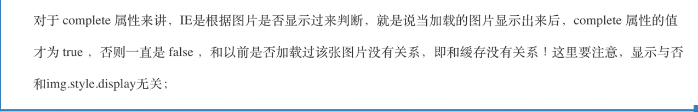

<!--
 * @Descripttion: 
 * @Author: yangxia
 * @Date: 2021-12-07 11:34:20
-->
1. 给元素 scrollLeft设置小数没有用，最终浏览器会四舍五入变成整数。设置scrollLeft的时候，``div.scrollLeft = totalLeft;`` div的宽度必须超过设定的宽度的时候才生效
[关于javascript宽高的记录](https://yangxiagithub.github.io/2018/12/10/%E5%85%B3%E4%BA%8Ejavascript%E5%AE%BD%E9%AB%98%E7%9A%84%E8%AE%B0%E5%BD%95/)

2. 获取文档滚动高度

```javascript
// 获取整个文档的滚动高度
window.pageYOffset || document.documentElement.scrollTop;
var top  = window.pageYOffset || document.documentElement.scrollTop
var left = window.pageXOffset || document.documentElement.scrollLeft;
// 滚动条的垂直高度
$(window).scrollTop()  
```

3. Orientationchange 事件获取不到window的宽和高

4. 

```css
-webkit-overflow-srcoll: auto
// 不能同时使用,否则滚动几下会出现卡顿
position：fixed 

// 会影响渲染权重，导致显示时间不一致，也就是权重小的元素会显示比较慢
Transform: translateZ(0); 
```

- 对于Absolute 元素，他的父元素overflow：hidden 失效，导致三个transition页面会在横向上显示出来。过程中我试过在祖先元素上translateZ或者position：relative，absolute等等办法提高祖先元素的垂直权重，但是依旧失效（不知道是否是因为absolute加了transform的原因），只有在祖先元素上使用fixed才能让overflow：hidden 生效。
- 然而-webkit-overflow-scrolling 不能与 fixed 同用，会能让页面滚动移动一段时间之后出现卡住的情况。
- 结合上面两点，决定舍弃使用fixed。为了不是使用fixed，我将每一页的absolute布局 变成了 整个页面是一个flex布局，每一页是一个flex-item，在flex布局元素上使用 transform。这样之后又有一个新的问题，就是每一页里面的fixed元素是不生效的 ，会变成absolute元素，解决办法是对必须使用fixed定位的元素移到body下面，与flex元素并列，这样fixed元素就生效了 （现在只对pop-dialog这样做，因为只有它必须使用fixed布局 ）
- 每一页的高度 必须相同，否则并排的三页中，其中某一页特别长，另外的页很短，在transition切页的时候切到短的那一页的时候会出现 空白，所以设置每一页的高度都是窗口高度，然后让每一页里面的子元素 进行滚动。

5. mouseenter和mouseleave事件不会冒泡，mouseover和mouseout事件会冒泡

focus/blur是不支持冒泡的

mousedown比click先执行，有时候click执行太晚了就用mousedown代替

6. 判断鼠标滚动方向

```javascript
var agent = navigator.userAgent;
if (/.*Firefox.*/.test(agent)) {
    document.addEventListener('DOMMouseScroll', function (e) {
        e = e || window.event;
        var detail = e.detail;
        if (detail > 0) {
            console.log('鼠标向下滚动了');
        } else {
            console.warn('鼠标向上滚动了');
        }
    });
} else {
    document.onmousewheel = function (e) {
        e = e || window.event;
        var wheelDelta = e.wheelDelta;
        if (wheelDelta > 0) {
            console.log('鼠标向上滚动');
        } else {
            console.warn('鼠标向下滚动');
        }
    };
}
```

7. a标签没有href就没有鼠标手

8. beforeunload不能发送异步请求, 一般用sendBeacon

9. touchstart touchmove touchend 事件中获取event有三个相近似属性

event.touches : 当前屏幕上所有触摸点的集合

event.targetTouches: 绑定事件的元素上触摸点的集合

event.changedTouches： 当前屏幕上触发事件是改变的触摸点的集合（一般在touchend的时候使用

滑动屏幕时：触发touchstart touchmove touchend，此时可以通过event.stopDefault() 来阻止click事件的触发点击屏幕时：触发touchstart touchend，此时也可以通过event.stopDefault() 来阻止click事件的触发

如果想区分用户是点击还是滑动屏幕，可以通过是否触发过touchmove事件
当不想区分用户是点击还是滑动屏幕，只想获得用户接触屏幕上的点时，可以在touchstart里面通过touchstart.targetTouches拿到一个touchList，然后在touchend事件里通过changedTouches获取一个touchList

10. Image 的onload事件在图片有缓存的时候可能会不执行，所以需要用complete属性去判断一下图片是否已经加载过了，但是complete在IE下有点问题：

所以可以用下面的代码来执行load事件的回调函数：

```javascript
var url = "http://......../image.jpg";
var img = new Image();
img.src = url;
// PS:naturalWidth只有高版本浏览器支持(safari,firefox,chrome,与opera10+)，低版本的话，直接用img.width
if(img.complete || img.width) {
    alert('该图片已经存在于缓存之中，不会再去重新下载');
    callback();
} else {
    img.onload = function(){
       callback();
    }
}
```

iframe的onload事件至今我还没发现会像image的onload那样出现不执行的情况

11. 前端对于302 是无感知的，开发人员并不知道进行了302, 302是浏览器行为。

不过像404，500这样的错误码会触发ajax的error方法，可以在error方法里面获取具体错误码是404还是500，这种情况对于开发人员是可感知的。

12. 使用原生js的时候，dom.style.xxx 只能拿到内联样式，拿不到css中的样式。得用``window.getComputedStyle``

```javascript
var card = document.querySelector('.card');
//这样可能取不到margin-left的值，因为card.style得到的是内联样式，如果margin-left写在css样式里，就得不到，
Var marginLeft = card.style.marginLeft;
// 这个时候需要用下面方法来获取元素的样式。
window.getComputedStyle(card).marginLeft
```

11. textContent和innerText

(1) textContent更标准。innerText was non-standard, while textContent  was standardized earlier.

(2) textContent不管样式，直接返回所有文本，而innerText意识到样式，不会返回隐藏元素的文本。

innerText returns the visible text contained in a node, while textContent returns the fulltext. For example, on the following HTML <span>Hello <span style="display: none;">World</span></span>, innerText will return 'Hello', while textContent will return 'Hello World'.

(3) textContent 会获取所有元素的内容，包括 \<script\> 和 \<style\> 元素，然而 innerText 不会


