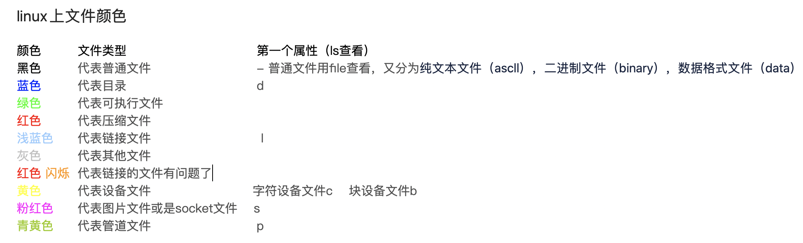
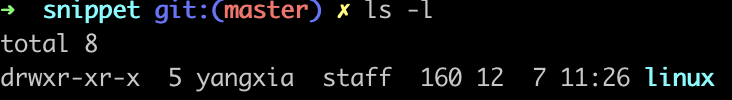

<!--
 * @Descripttion: 
 * @Author: yangxia
 * @Date: 2021-12-06 17:45:00
-->

# linux命令

## 一. lsof

描述：lsof (list open file) 列出当前系统打开的文件

```shell

# 列出占用8080端口的进程
lsof -i:8080
```

## 二. ps

描述：ps(process status）列出系统中当前运行的那些进程

tip: ps命令指示显示进程的快照，如果要动态显示进程信息，请使用top

```shell
# 查看与tomcat有关的进程信息，里面会包含进程id
ps -ef | grep tomcat
ps aux | grep tomcat
```

## 三. netstat

描述：netstat，用于显示网络相关的信息。如网络连接，路由表，接口状态(interface statistics)等等。

```shell
netstat -apn
netstat -apn | grep 8080
```

## 四. curl和wget

### 1. curl

[参考链接](https://www.cnblogs.com/duhuo/p/5695256.html)

描述：curl是一个命令行下载工具

(1)基本用法：

``` shell
curl http://www.linux.com
```

执行后http://www.linux.com的html就会展示在shell框中了

(2)保存访问的页面

- 使用linux的重定向功能保存

```shell
curl http://www.linux.com >> linux.html
```

- 使用curl内置option -o（小写）保存网页

```shell
curl -o linux.html http://www.linux.com
```

(3)常见参数

[见参考链接](https://www.cnblogs.com/duhuo/p/5695256.html)

### 2. wget

描述：用于从网络上下载资源，没有指定目录则默认为本地目录

(1)和wget的异同

同：wget和curl都可以下载网上资源文件。

异：

- curl需要将内容重定向到一个文件里面，而使用wget直接就是将网上文件下载到当前目录，比较方便

- curl可以模拟post请求，wget只能是get请求

(2)基本用法

```shell
# 将这个文件下载到当前目录下(下载下来之后文件名字就叫index.html)
wget https://www.gogokid.com/wx-service/reserve/index.html 
```

## 五.homebrew

描述：用来安装和卸载软件，简称brew命令

```shell
# 安装wget
brew install wget
# 卸载wget
brew uninstall wget
# 列出所有通过homebrew
brew list
```

## 六.nano

描述：字符终端的一个文本编辑器，类似于vi/vim

(1)复制、剪切、粘贴：

复制一整行：Alt+6

剪贴一整行：Ctrl+K

粘贴：Ctrl+U

如果需要复制／剪贴多行或者一行中的一部分，先将光标移动到需要复制／剪贴的文本的开头，按Ctrl+6（或者Alt+A）做标记，然后移动光标到 待复制／剪贴的文本末尾。这时选定的文本会反白，用Alt+6来复制，Ctrl+K来剪贴。若在选择文本过程中要取消，只需要再按一次Ctrl+6。

(2)搜索

按Ctrl+W，然后输入你要搜索的关键字，回车确定。这将会定位到第一个匹配的文本，接着可以用Alt+W来定位到下一个匹配的文本。

(3)翻页

Ctrl+Y到上一页.Ctrl+V到下一页

(4)保存

使用Ctrl+O来保存所做的修改

(5)退出

按Ctrl+X

## 七.查询命令：find、type、whereis、which、locate

[参考地址](https://gist.github.com/marshluca/829153)

1. find
描述：find是最常见和最强大的查找命令，你可以用它找到任何你想找的文件。

find的使用格式如下：

　　find <指定目录> <指定条件> <指定动作>

　　- <指定目录>： 所要搜索的目录及其所有子目录。默认为当前目录。

　　- <指定条件>： 所要搜索的文件的特征。

　　- <指定动作>： 对搜索结果进行特定的处理。

```shell
# 搜索当前目录（含子目录，以下同）中，所有文件名以my开头的文件。
find . -name 'my*'
# 搜索当前目录中，所有文件名以my开头的文件，并显示它们的详细信息。
find . -name 'my*' -ls
# 搜索当前目录中，所有过去10分钟中更新过的普通文件。如果不加-type f参数，则搜索普通文件+特殊文件+目录
find . -type f -mmin -10
```

2. locate

描述：locate命令其实是``find -name``的另一种写法，但是要比后者快得多，原因在于它不搜索具体目录，而是搜索一个数据库（/var/lib/locatedb），这个数据库中含有本地所有文件信息。Linux系统自动创建这个数据库，并且每天自动更新一次，所以使用locate命令查不到最新变动过的文件。为了避免这种情况，可以在使用locate之前，先使用updatedb命令，手动更新数据库。

```shell
# 搜索etc目录下所有以sh开头的文件。
locate /etc/sh
# 搜索用户主目录下，所有以m开头的文件。
locate ~/m
# 搜索用户主目录下，所有以m开头的文件，并且忽略大小写
locate -i ~/m
```

3. whereis: 搜索程序/二进制文件的位置，且可能返回多个信息

whereis locates source/binary and manuals sections for specified files.

描述：whereis命令只能用于**程序名**的搜索，而且只搜索二进制文件（参数-b）、man说明文件（参数-m）和源代码文件（参数-s）。如果省略参数，则返回**所有信息**。

```shell
whereis php
# php: /usr/bin/php /usr/share/php /usr/share/man/man1/php.1.gz
```

4. which：返回系统所使用的的可执行命令的位置

which returns the pathnames of the files which would be executed in the current environment。

Basically, whereis searches for "possibly useful" files, while which only searches for executables.

I rarely use whereis. On the other hand, which is very useful, specially in scripts. which is the answer for the following question: Where does this command come from?

[参考地址](https://superuser.com/questions/40301/which-whereis-differences)

which命令的作用是，在PATH变量指定的路径中，搜索某个系统命令的位置，并且返回第一个搜索结果。也就是说，使用which命令，就可以看到某个系统命令是否存在，以及执行的到底是哪一个位置的命令。

```shell
which php
# /usr/bin/php
```

5. type：查看命令是否是内置的

描述：type命令其实不能算查找命令，它是用来区分某个命令到底是由shell自带的，还是由shell外部的独立二进制文件提供的。如果一个命令是外部命令，那么使用-p参数，会显示该命令的路径，相当于which命令。

```shell
# cd is a shell builtin. 系统提示，cd是shell的自带命令（build-in）。
type cd

# grep is an alias for grep --color=auto --exclude-dir={.bzr,CVS,.git,.hg,.svn,.idea,.tox}
type grep

# grep is /usr/bin/grep. 相当于which命令（在mac上相当于whereis）
type -p grep
```

## 八.查看文件类型 file、ls

```shell
file readme.md
# read.md: exported SGML document text, UTF-8 Unicode text

ls -l readme
# -rw-r--r--  1 yangxia  staff  137 12  6 17:41 read.md
ls -l
# drwxr-xr-x  5 yangxia  staff  160 12  7 11:26 linux
```

不同文件类型颜色不同，但是在mac上是可以更改的shell工具的配置文件进行修改的



## 九.压缩和解压缩：zip/unzip/tar

1. zip和unzip

```shell
# 1. 我想把一个文件abc.txt和一个目录dir1压缩成为yasuo.zip：
zip -r yasuo.zip abc.txt dir1

# 2.我下载了一个yasuo.zip文件，想解压缩：
unzip yasuo.zip

# 3.我当前目录下有abc1.zip，abc2.zip和abc3.zip，我想一起解压缩它们：
unzip abc\?.zip

# 4.我有一个很大的压缩文件large.zip，我不想解压缩，只想看看它里面有什么：(v:verbose)
unzip -v large.zip

# 5.我下载了一个压缩文件large.zip，想验证一下这个压缩文件是否下载完全了(t:test)
unzip -t large.zip
```

2. tar

| 命令   | 含义  |
| ----  | ----  |
| -c    | 建立压缩文档（create）|
| -x    | 解压（extract）|
| -t    | 查看内容（list）|
| -r    | 向压缩归档文件末尾添加文件（accretion）|
| -u    | 更新原压缩包中的文件（update）|

这5个是独立的命令，解压压缩都要用到其中的一个，可以和别的命令连用，但只能用其中一个。下面的参数是根据需要在压缩或者解压的时候可选用的：

| 命令   | 含义  |
| ----  | ----  |
| -z    | 带有gzip属性的
| -j    | 带有bz2属性的
| -v    | 显示所有过程（verbose）

参数-f是必须的：代表使用档案的名字（就是目标文件名），切记这个参数是最后一个参数，他的后面只能跟文件名（file）

```shell
# 解压：
tar -xvf file.tar 解压file.tar
tar -xzvf file.tar.gz 解压file.tar.gz
tar -xjvf file.tar.bz2 解压file.tar.bz2
tar -xjvf file.tar.bz2 index.html 只解压file.tar.bz2里面的index.html文件
tar -xjvf file.tar.bz2 -C /etc 解压file.tar.bz2到/etc目录下
# 压缩：
tar -cvf jpg.tar *.jpg 将所有jpg文件打包压缩成tar.jpg
```
