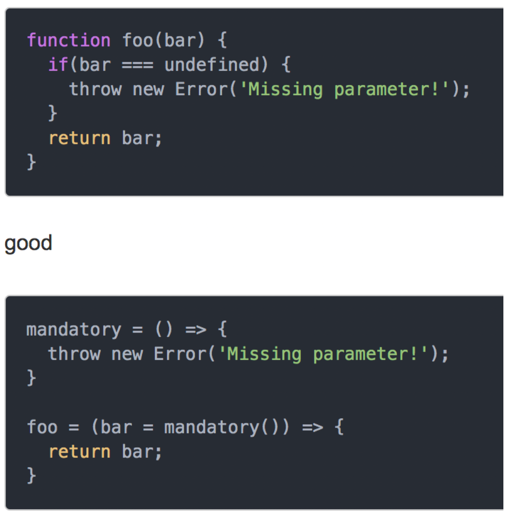
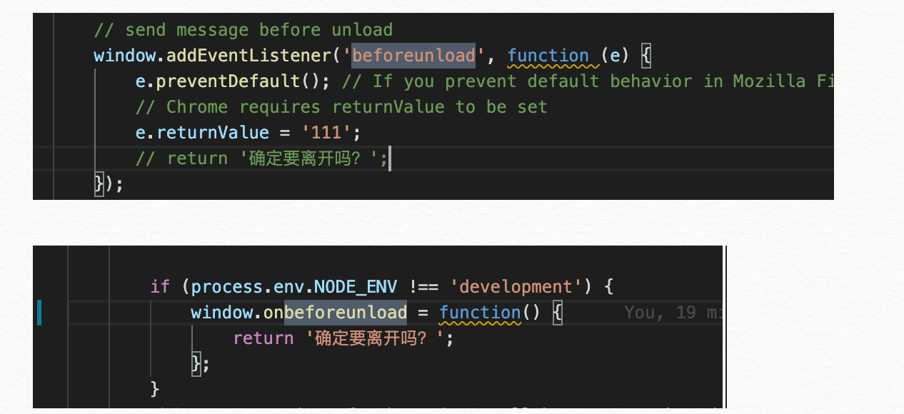

<!--
 * @Descripttion: 
 * @Author: yangxia
 * @Date: 2021-12-06 20:50:41
-->

# javascript注意点

1. [7,1,5,3,6,4] reduce函数如果传入了第二个参数，就会执行6次，如果不传入第二个参数则只会执行5次

2. ES6

a. 结构赋值

(1)结构赋值只在undefined 的时候生效，null和'' 都不会生效

``` javascript
const { animationData = loadingData, autoplay, title } = props;
```

(2) 利用解构赋值来交换变脸

```javascript
let a = 1;
let b = 2;
[a, b] = [b, a];
```

b. padStart padEnd repeat

```javascript
'sd'.repeat(3) // 'sdsdsd'
'x'.padStart(5, 'ab') // 'ababx'
'x'.padStart(4, 'ab') // 'abax'
'x'.padEnd(5, 'ab') // 'xabab'
'x'.padEnd(4, 'ab') // 'xaba'
```

c. 双冒号

左边是一个对象，右边是一个函数。该运算符会自动将左边的对象，作为上下文环境（即this对象），绑定到右边的函数上面

```javascript
function bar(){
  //
}
var foo = {}
foo::bar // 等同于 bar.bind(foo)
```

d. Array.from方法用于将两类对象转为真正的数组：类似数组的对象（array-like object）和可遍历（iterable）的对象（包括 ES6 新增的数据结构 Set 和 Map）

e.  Array.of方法用于将一组值，转换为数组.    Array.of基本上可以用来替代Array()或new Array()，并且不存在由于参数不同而导致的重载

```javascript
Array.of(1,2,3) // 返回[1,2,3]
```

3. 字符串的方法：slice，substring，substr
数组的方法: slice, splice
第二个参数为下标： slice， substring
第二个参数为长度： splice，substr

4. 使用构造函数生成实例的时候，是先将原型上的属性赋值给了实例，再执行的constructor函数的，所以在constructor函数里面可以获取到当前实例的原型上的属性。

5. 函数用bind绑定this之后不能再用bind去改变this了

6. 解释型语言（interpreted language）（如js）运行时需要预编译+运行。
编译型语言（compiled language）（如c语言）运行之前需要编译，编译完了之后再运行，所以它运行比解释型语言快

7. 观察者模式

```javascript
Object.defineProperty(this, 'route', {
    get: () => {
        return this.history.current;
    }
});
```

改变了a就要 执行一个函数，那么把a变成被监听者，创建一个监听者，把这个函数作为监听者的callback

8. let const 相比较于var 有了局部作用域，但是没有变量提升，所以会出现暂时性死区

9. 技巧学习
(1) 强制必须传参：当函数参数使用默认值的时候就会执行mandatory，抛出错误。



10. 问题： https://github.com/webpack/webpack/issues/4039

- 一个文件内导入如果是require  ，导出时候可以搭配module.exports 和 ES6的export
(function(module, exports, __webpack_require__) {}
- 一个文件导入如果是import，导出必须是ES6的export
 (function(module, __webpack_exports__, __webpack_require__) {}

由于使用'@babel/plugin-transform-runtime’时候webpack会自动将@babel/plugin-transform-runtime内部函数使用import的形式导入文件，所以这个文件在导出的时候只能使用ES6的export导出

11. 将一个数组合并进去另一个数组

```javascript
queue.push.apply(queue, dependencies); 
// 或者
queue = queue.concant(dependencies);
 ```

功能：可以将dependencies这个数组里的内容一次性传递给queue，否则需要这样写：queue.push(dependencies[0], dependencies[1], dependencies[2])

12. forEach可以跳出某个item的逻辑，但是forEach 没办法跳出整个循环。解决方法：可以使用基础的for循环，或者使用every或者some代替.

13. import和require的区别

[我的博客地址](https://yangxiagithub.github.io/2018/07/16/import%E5%92%8Crequire%E5%8C%BA%E5%88%AB/)

总结一下区别和相同点

区别：

- require是commonJS模块的导入方式，对应的导出方式为``module.exports``。import是ES模块的导入方式，对应的导出方式为export

```javascript
// commonJS模块导出机制
module.exports = 1;
// 或者
module.exports = {a: 1, b: 2};
// 或者
exports.a = 1; exports.b = 2
// 但是不能是下面形式，因为exports 是一个形参，形参赋值后对外层无影响
exports = {a: 1, b:2}
```

```javascript
// ES 模块导出机制
// import a from './index'
export default a; 
// import { a } from './index'
export {
    a: 1
}
```

- require是执行时引入，是动态的，所以可以在require中编写变量，比如``const url = “a” + “b”;require(url)``。但是import是编译时的引入，是静态的，不允许在import语句中有变量

- require不会进行变量提升，import会进行变量提升（因为一个动态，一个静态）

- require得到的变量可以修改，import不可以（因为es6里对于导出数据做了只读限制）

- require得到的是导出的整个对象（或者基本类型数据）的拷贝值（也就是赋值语句的得到的值），而import得到的是导出的一定会是一个对象（不像module.exports = 1这种导出的就是一个基本数据类型），即使是``export default a = 1``导出的也是 ``{ default: 1}``。

相同点

- 对于同一个被引入的文件，只会执行一次

14. navigator.onLine检查是否有网

15. 语句和表达式的区别

- 语句表示执行了一个动作（程序是由语构成，语句则是有“；”分隔的句子或命令）

- 表达式是有返回值的（表达式是由运算法构成，并运算产生结果）

16. 夏令时和冬令时

夏令时：到凌晨2点的时候，直接变成凌晨3点（这一天少了1个小时，只有23小时）

冬令时：到凌晨3点的时候，回退变成凌晨2点的时间。

在2018-3-11 也就是夏令时的那一天

- （1）+new Date('2018-3-11 02:00:00')

得到：1520751600000

- （2）+new Date('2018-3-11 03:00:00')

得到： 1520751600000

- （3）new Date(1520751600000)

得到：Sun Mar 11 2018 03:00:00 GMT-0400 (北美东部夏令时间)

两个字符串得到的是同一个时间戳，但是用这个时间戳去获取字符串，发现获取的是3点的字符串，而不是两点。
所以这就是   字符串到时间戳是多对一；时间戳到字符串是一对一

17. 「采坑经历」使用visibilitychange事件时，需要挂在document上

```javascript
document.addEventListener('visibilitychange', handleVisibilityChange);
// 不能挂在window上，否则safari会有问题，因为safari的这个事件不会从document冒泡到window
```

18. 「采坑经历」pagehide事件在safari 14及之前版本都不支持。所以还是用visibilitychange事件吧

```
document.addEventListener('visibilitychange', handleVisibilityChange)
```

19. babel的插件虽然所是plugin运行在preset之前，但是他只是引入插件源码有这个顺序，真实遍历的时候，babel只会遍历一遍，所以program节点的遍历一定会是最早的，即使是preset中的program也会比plugin中的jsxAttribute节点要早。 
见[stackoverflow](https://stackoverflow.com/questions/34618756/babel-plugins-run-order)


20.「采坑经历」 window.addEventListener('beforeunload')和window.onbeforeunload 在没有用户交互的时候，不会触发页面阻塞，不会显示询问框。同时他俩的区别：


21. 

```javascript
// 假如user存在，那么session中会出现user这个key，如果user不存在则不会出现这个key。这种简便写法可以学习下
const session = new Session({
    a: 1,
    ...(user && { user:  'hhh'}),
});
```
