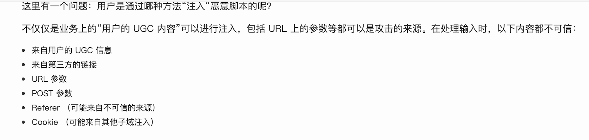

<!--
 * @Description: 
 * @Author: yangxia
 * @Date: 2021-12-29 20:39:59
-->

# CSRF 跨站请求伪造

1. CSRF——跨站请求伪造  cross-site request fake
主要是在用户登录正常网站A之后，访问黑客网站B，B又访问A的接口并且带上了A网站的cookie，从而达到伪造用户请求的效果

2. 前提 ：用户登陆了银行网站，浏览器已经有了银行网站的cookie，在攻击者网站向银行网站发一个转账请求（要用img，script，iframe等有src属性的标签。如果使用ajax的话会被浏览器的跨域限制），这时候浏览器以为这个请求是用户发的，所以直接带上银行的cookie去请求银行网站，最后，攻击者成功了。

Csrf主要还是利用cookie来伪造用户请求

图片设置了img.corssOrigin='anonymous'这张图的请求就不会带cookie了

3. [学习链接](https://tech.meituan.com/2018/10/11/fe-security-csrf.html)

# Xss 跨站脚本攻击

1. cross-site script 跨站脚本攻击
主要是在前端页面注入恶意代码，达到攻击效果

解决方案：CSP 浏览器的内容安全策略（配置白名单）