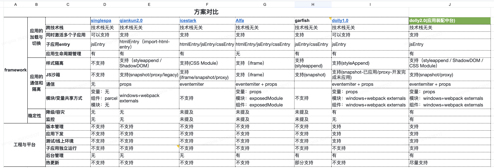

<!--
 * @Description: 
 * @Author: yangxia
 * @Date: 2021-12-31 15:28:55
-->

# 一. 微前端解决什么问题，带来的好处

[参考文档1](https://zhuanlan.zhihu.com/p/964644010)
[参考文档2](https://zhuanlan.zhihu.com/p/78362028)

1.疑惑？为什么非得使用微前端，不能用MPA吗，也就是用location.href=xxx的换页方式？

回答：

(1)因为MPA之间页面切换会造成浏览器重刷，产品域名之间互相跳转，流程体验上会存在断点。

(2)SPA 则天生具备体验上的优势，应用直接无刷新切换，能极大的保证多产品之间流程操作串联时的流程性。缺点则在于各应用技术栈之间是强耦合的。

(3)而微前端则结合了SPA和MPA的好处，应用间既能无缝切换，保证用户体验流程的串联完整性，又能让不同应用之间技术无关，独立开发和部署。

总结微前端好处：
(1) 技术无关，独立开发，独立部署.
(2) 从而可以解决2种情况：a. 巨石应用，可以分开打包 b. 同一应用使用不同技术栈

2. 微前端方案对比

dolly和qiankun 都是基于single-spa做的

- single-spa 是一个用于前端微服务化的 JavaScript 前端解决方案 (本身没有处理样式隔离， js 执行隔离) 实现了路由劫持和应用加载

- qiankun 基于Single-SPA, 提供了更加开箱即用的 API （ single-spa + sandbox+ import-html-entry ） 做到了，技术栈无关、并且接入简单（像iframe 一样简单）

# 二. 微前端的技术难点

1. 多个bundle之前如何集成
    - 服务端集成
    - 构建时集成（npm包）
    - 运行时集成（现在微前端公用方案）
        - iframe
        - js，比如前端路由（常用）
            - js entry
            - html entry（只是充当一个配置表的作用，可以优化成一个资源配置）
        - web component（每个子应用封装成html，通过shadow dom放入页面）

2. 各个子应用之间如何隔离
    - css 隔离
        - 动态样式表（在子应用unmount后把styleSheets删除）
        - css module（通过添加css前缀隔离样式，当然不是人功能加，是工程化手段加的）
        - css in js
        - 开发规范BEM（感觉依赖开发规范不可靠）
        - 如果用web component，则天然有shadow dom的特性做样式隔离
    - js隔离
        - sandbox沙箱（快照沙箱、代理沙箱）

3. 各个子应用间如何通信

4. 公共资源复用

