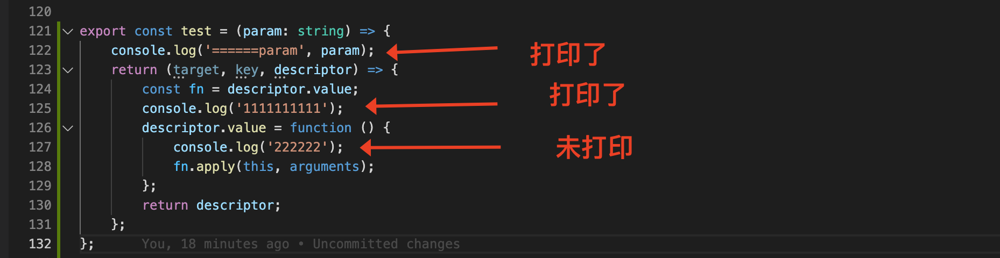
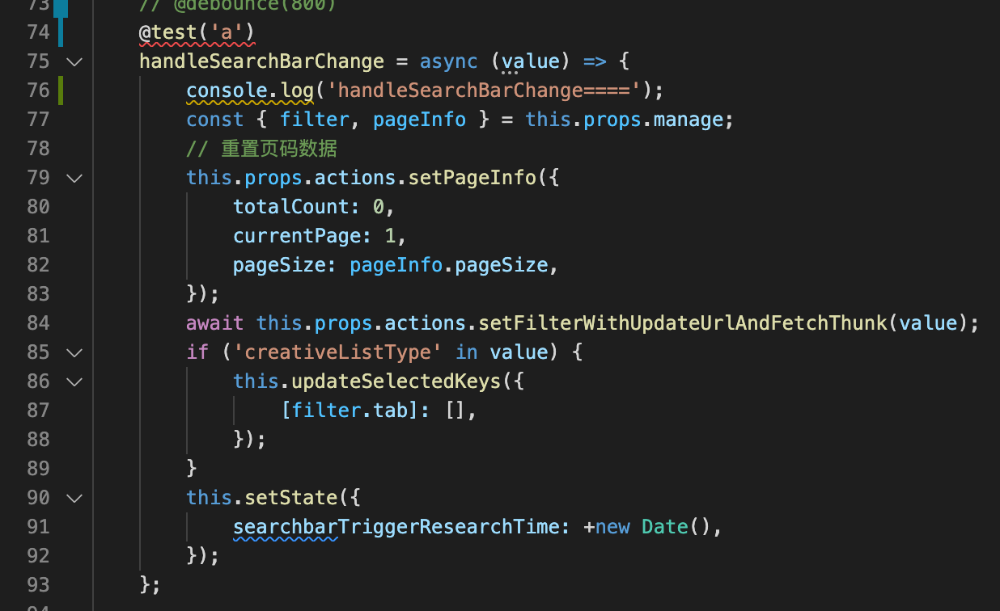

<!--
 * @Description: 
 * @Author: yangxia
 * @Date: 2022-01-04 21:38:34
-->
[参考文章](https://segmentfault.com/a/1190000014495089)
[参考文章](https://segmentfault.com/a/1190000015566627)
[参考文章](https://blog.si-yee.com/2020/08/25/Typescript%E8%A3%85%E9%A5%B0%E5%99%A8%E8%AE%B2%E8%A7%A3/)

# 一. 装饰器的分类

    - 类装饰器
    - 类方法的装饰器

主要是这两种，另外还有函数参数装饰器等等，不常用

```javascript

@logClass1('www.baidu.com')
@logClass2('www.qq.com')
Class A {
    @enableLoadingStatus
    hi () {}
}

// 类方法装饰器
const enableLoadingStatus = (loadingStatusKey?) => (target, key, descriptor) => {
    loadingStatusKey = loadingStatusKey || 'loading';
    const fn = descriptor.value;
    descriptor.value = async function() {
        this.setState({ [loadingStatusKey]: true });
        await fn.apply(this, arguments);
        this.setState({ [loadingStatusKey]: false });
    };
    return descriptor;
};

// 类的装饰器
const logClass2 = (text) => {
    return function (target) {
        console.log('text');
    }
}
```

# 装饰器的顺序

```javascript
function dec(id){
  console.log('evaluated', id);
  return (target, property, descriptor) => console.log('executed', id);
}

class Example {
    @dec(1)
    @dec(2)
    method(){}
}
// evaluated 1
// evaluated 2
// executed 2
// executed 1
```
如果同一个方法有多个装饰器，会像剥洋葱一样，先从外到内进入，然后由内向外执行。

# 装饰器的执行时机

一个case：



问题1: fn.apply执行的时候，‘2222’为啥不打印呀？这两个都是desciptor.value的内容呀

回答1: 靠，handleSearchBarChange写成箭头函数，就变成静态属性了，不再是原型上的方法了，所以descriptor.valule 赋值无效。。。

问题2: 装饰器的执行时机是什么时候？

回答2：下面是阮一峰博客的一段话：

注意，装饰器对类的行为的改变，是代码编译时发生的，而不是在运行时。这意味着，装饰器能在编译阶段运行代码。也就是说，装饰器本质就是编译时执行的函数。

和我理解的不太一样，我的理解：

- 至于装饰器的执行时机，我的理解是：所谓的【编译】并不是我们所说的webpack编译阶段，我理解这个【编译】是相对于【被装饰函数的运行】来说的，甚至我感觉这个说法就有问题。首先有一个关系是：装饰器生成函数（decoratorGen）   生成  装饰器（decorator） ， 装饰器  装饰 一个函数（fn）。decoratorGen函数和decorator都是在类（或者类的方法）的定义时候自动执行的，所以上面‘params’ 和 ‘1111’是在进入页面，没有任何操作的时候打印的；而fn众所周知肯定是在调用之后才执行。

- 所以我还是觉得装饰器是在【运行阶段】执行的，只不过不是在fn调用时执行，而是在类（或类方法）定义时执行（或者叫孟涛所说的【装载时】？）
