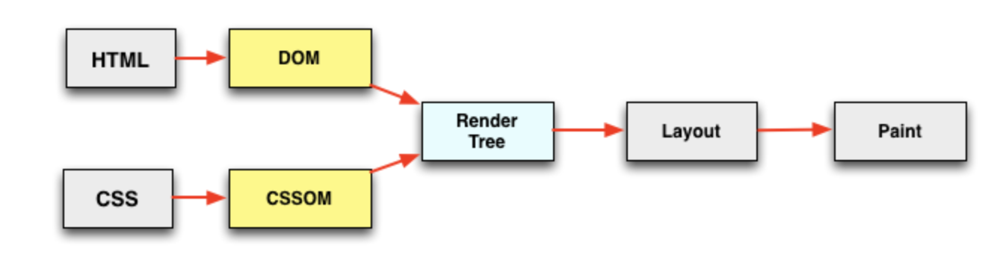

<!--
 * @Description: 
 * @Author: yangxia
 * @Date: 2022-02-10 10:31:13
-->

[参考文档](https://zhuanlan.zhihu.com/p/25876048)

# 一. DOMContentLoaded

解释：当一个 HTML 文档被加载和解析完成后，DOMContentLoaded 事件便会被触发（DOMContentLoaded仅仅涉及DOM，不涉及CSSOM， 但是有的时候CSSOM的解析会影响DOM的解析）

1. 当没有javascript时：DOM树和CSSOM树并行解析，互相不影响


**总结，当没有脚本的时候，浏览器解析完html文档便能触发DOMContentLoaded 事件**

2. 当存在javascript时

考虑几个点：

(1) javascript 阻塞dom的解析（因为javascript可以改变dom）

也就是说当浏览器在解析 HTML 文档时，如果遇到\<script\>,便会停下对 HTML 文档的解析，转而去处理脚本。如果脚本是内联的，浏览器会先去执行这段内联的脚本，如果是外链的，那么先会去加载脚本，然后执行。在处理完脚本之后，浏览器便继续解析 HTML 文档。看下面的例子

``` html
<body>
  <script type="text/javascript">
  console.log(document.getElementById('ele')); // null
  </script>

  <div id="ele"></div>

  <script type="text/javascript">
  console.log(document.getElementById('ele')); // <div id="ele"></div>
  </script>
</body>
```

(2) css的加载和解析阻塞javascript的执行

由于javascript可以查询任意样式，所以意味着在css解析完成（也就是CSSOM生成之后），javascript才可以执行。

但是CSS加载只会阻塞其后面位置JS的执行，其前面位置js的执行不会被阻塞

**（1）点 + （2）点的总结：如果文档中包含脚本，则脚本会阻塞文档的解析，而脚本需要等 CSSOM 构建完成才能执行**

(3) css的加载不会阻塞dom树的解析（因为DOM和CSSOM是两棵互不影响的树），但是会阻塞dom树的渲染（因为渲染需要DOM+CSSOM共同作用才能完成）

[参考文档](https://segmentfault.com/a/1190000018130499)

(4) 考虑异步脚本

脚本可以分为内联脚本和外链脚本，外链脚本又可以分为同步脚本和异步脚本。HTML5中定义了两个异步脚本的方法：defer 和 async


这里主要思考async 和 defer 对 DOMContentLoaded 事件触发的影响

① defer与DOMContentLoaded

如果 script 标签中包含 defer，那么这一块脚本将不会影响 HTML 文档的解析，而是等到 HTML 解析完成后才会执行。而 DOMContentLoaded 只有在 defer 脚本执行结束后才会被触发。 所以这意味着什么呢？HTML 文档解析不受影响，等 DOM 构建完成之后 defer 脚本执行，但脚本执行之前需要等待 CSSOM 构建完成。
**在 DOM、CSSOM 构建完毕，之后defer 脚本执行完，最后才是DOMContentLoaded 事件触发**

② async 与 DOMContentLoaded

**如果 script 标签中包含 async，则 HTML 文档构建不受影响，解析完毕后，DOMContentLoaded 触发，而不需要等待 async 脚本执行、样式表加载等等。**

# 二. performance.timing 事件的顺序图


document.readyState:
loading(正在加载)
interactive(可交互。文档已经被解析，DOMContentLoaded事件触发)
complete(完成。文档和所有子资源已完成加载)

# 三.slardar

看sladar源码之后发现：

1. 对于页面性能处理基本使用的是performance这个API
2. 上报是使用一个new Image()去进行上报数据。
3. 关于首屏和白屏他是这么区分的：

白屏:params.blank = performance.timing.responseEnd - performance.timing.navigationStart; 不过有的人是用responseStart 而不是responseEnd值。

首屏:它是将在页面高度内（即第一屏）的图片加载完成当做首屏时间

- 疑问1：我个人觉得有些地方不是特别准确。比如白屏时间sladar是算的performance.timing.responseEnd-performance.timing.navigationStart，但是如果我的js特别消耗时间，那么在respond结束之后js执行期间，页面还是处于白屏，而这个时间slardar没有算进去。

- 疑问2：Sladar只是将首屏图片的加载完成当做首屏时间，然而如果js（内联或者外链）执行时间很久的话，由于资源加载和js执行是两个线程，那么会不会有可能图片加载完成的时候js还没执行完，这样算出来的首屏时间准吗？后来发现这个没问题，因为只有js执行完了，才会执行图片onload注册的异步事件。执行这个异步事件的时候，说明js已经执行完了。

# 四. 总结

总的来说DOMContentLoaded中的’DOM‘指的是DOM树，与CSSOM树无关。

谁能影响DOMContentLoaded执行时机？：由于DOM树可以被js改变，所以需要等js执行完才能DOM树才能被解析完成；而js的执行又受到CSSOM树解析的影响，因为js会获取样式信息，所以CSSOM影响js执行时机则间接影响了DOMContentLoaded的时机。

针对js影响DOM的解析的问题，可以通过异步脚本解决。异步脚本中的async脚本是不会影响DOMContentLoaded的（一般默认async脚本不会改变dom，当然其实使用起来也不一定会真的不改变dom）。而defer脚本只是代表延迟执行，它是会影响DOMContentLoaded时机的。

同时需要注意

css影响范围：css的加载不会阻塞dom树的解析，但是会阻塞dom树的渲染，也会阻塞其后面位置的js的执行。

js影响范围：

a.内联js阻塞后面的dom解析，不阻塞前面的dom解析。但是阻塞所有dom的渲染

b.正常情况下，外链的同步js会阻塞其后面位置dom的解析（其前面位置的dom树解析不受影响，因为js能拿到前面的dom信息）和整体的渲染（因为js可以修改dom树，所以渲染会被影响）。但是有一种说法是浏览器优化后不阻塞前面的dom的解析和渲染，理由如下：

- 为什么不影响前面的dom树的解析和渲染？：为了更好的用户体验，渲染引擎将会尽可能早的将内容呈现到屏幕上，并不会等到所有的html都解析完成之后再去构建和布局render树。它是解析完一部分内容就显示一部分内容，同时，可能还在通过网络下载其余内容(预解析)。（这段话是《how browsers work》里面讲的，让我茅塞顿开）

c.外链的异步js影响范围在前面部分可看

# 五.额外信息

1. 写了一个耗时很久的for循环：（亲测有效）

(1) 对于ssr的页面，把\<script src=“a”></script> 放在\<body\>\</body>后面不会阻塞页面渲染（注意一定要在\</body>后面，在\</body>前面不行），浏览器在执行耗时很久的js之前，会把body里面的dom渲染出来，这就是大家所说的把js放在底部的原因。

(2) 不过对于那些用js生成dom的页面来说，其实没什么区别，反正都是要先执行完js才能得到dom结构，即使script标签放在底部页面依然得执行完js之后才能渲染有效dom。

2. 
(1) window.performance.getEntriesByType( 'navigation’)返回一个PerformanceNavigationTiming的实例，里面的属性也是时间戳，但是不是距离1970年零点的时间戳，是一个比较小的值，我猜测是距离navigationStart的时间（这个时间比较小，是几十或者几百的样子。如果是距离1970年零点的时间戳，那么应该是一个很大的数字）

（2）Date.now()  返回的是距离1970年零点的时间戳
performance.now()输出的是相对于 performance.timing.navigationStart(即页面初始) 的时间。